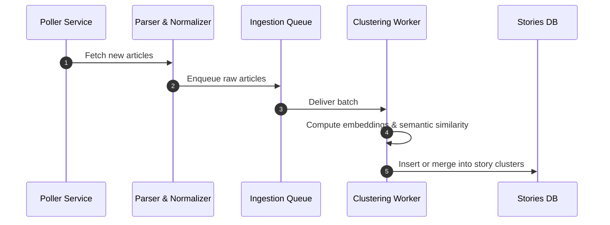
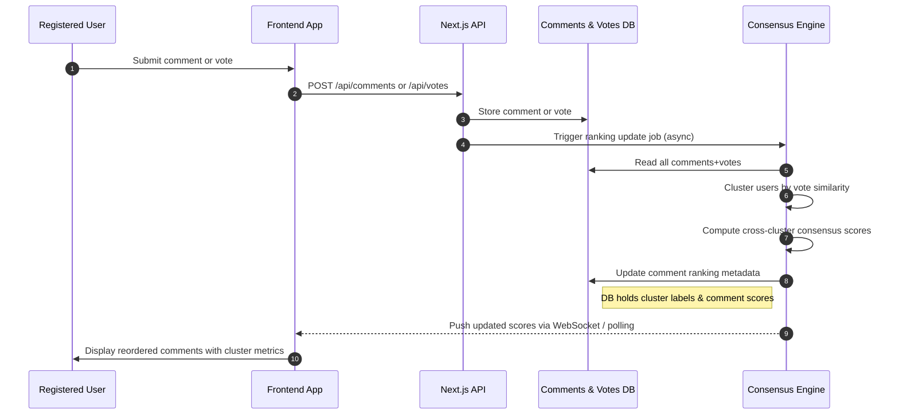

# Technical Implementation & Architecture Plan

## 1. Overview

This document outlines the technical implementation plan and system architecture for the News Aggregator with Crowdsourced Bias Insights. It covers:

- Major components and services
- Sequence diagrams for core workflows
- Repository structure
- Phased implementation plan with milestones

---

## 2. System Architecture

```mermaid
flowchart TB
  subgraph Ingestion Service
    A[NewsAPI / RSS Poller]
    B[Parser & Normalizer]
    C[Ingestion Queue]
  end

  subgraph Clustering Service
    D[Story Clustering Worker]
    E[Deduplicated Stories DB]
  end

  subgraph API Layer
    F[Next.js API Routes]
    G[Consensus Engine]
    H[Comments & Votes DB]
    I[User Cluster Store]
  end

  subgraph Frontend
    J[Next.js App (App Router)]
    K[Shadcn UI Components]
  end

  A --> B --> C --> D --> E
  E --> F
  H --> G --> I
  F --> J
  I --> J
  J --> H
  J --> G
```

**Description:**
- **Ingestion Service:** Fetches and normalizes news articles from APIs/RSS, queues for clustering.
- **Clustering Service:** Groups articles into deduplicated story clusters using NLP.
- **API Layer:** Exposes endpoints for news, comments, votes; runs consensus engine and stores user clusters.
- **Frontend:** Next.js app with Shadcn UI, interacts with API and displays news, comments, and consensus insights.

---

## 3. Core Sequence Diagrams

### 3.1 Article Ingestion & Clustering



### 3.2 Commenting & Consensus Ranking



---

## 4. Repository Structure

```
news-aggregator/
├── README.md
├── package.json
├── tsconfig.json
├── .env.example
├── prisma/
│   └── schema.prisma        # DB schema for Supabase/Postgres
├── lib/                     # Shared utilities
│   ├── embeddings.ts        # Embedding helpers
│   ├── clustering.ts        # Clustering algos
│   └── consensus.ts         # Consensus scoring logic
├── services/
│   ├── ingestion/           # Ingestion microservice code
│   │   ├── poller.ts        # News API/RSS poller
│   │   └── parser.ts        # Article parser
│   ├── clustering/          # Story clustering worker
│   │   └── worker.ts
│   └── consensus/           # Consensus engine job
│       └── job.ts
├── app/                     # Next.js App Router
│   ├── api/
│   │   ├── news/            # Endpoints: /api/news
│   │   ├── comments/        # Endpoints: /api/comments
│   │   └── votes/           # Endpoints: /api/votes
│   ├── components/          # UI components (Shadcn + custom)
│   └── page.tsx             # Main landing page
├── public/                  # Static assets
├── prisma/                  # Prisma client generation
├── tests/                   # Unit & integration tests
│   ├── ingestion.test.ts
│   ├── clustering.test.ts
│   └── consensus.test.ts
└── docker-compose.yml       # Local dev environment
```

---

## 5. Implementation Plan & Milestones

| Phase                              | Duration | Deliverables                                                                                 |
|-------------------------------------|----------|---------------------------------------------------------------------------------------------|
| **Phase 1: Foundation**             | 2 weeks  | Setup monorepo & dev environment (Docker, Supabase); Basic Next.js app; Ingestion services  |
| **Phase 2: Core API & UI**          | 3 weeks  | Next.js API routes for news feed; Frontend feed page; End-to-end ingestion → clustering     |
| **Phase 3: Comment System**         | 2 weeks  | Comments & votes endpoints; Frontend comment UI; Store comments & votes in DB               |
| **Phase 4: Consensus Engine**       | 3 weeks  | User behavioral clustering; Consensus scoring; Ranking jobs; Expose cluster metrics in API  |
| **Phase 5: Integration & Polishing**| 2 weeks  | Real-time updates (WebSockets/polling); UI for consensus notes; UX refinements, performance |
| **Phase 6: Testing & Launch**       | 2 weeks  | Comprehensive tests; Load testing; Deployment to staging & production on Vercel             |

---

## 6. Notes
- All backend services are designed to be modular and scalable.
- Use Supabase for authentication, Postgres DB, and storage.
- All API endpoints are typed and validated with Zod.
- UI leverages Shadcn UI components and Tailwind CSS for styling.
- Real-time updates via WebSockets or polling for consensus metrics.
- Testing includes unit, integration, and load tests for ingestion and consensus pipelines. 